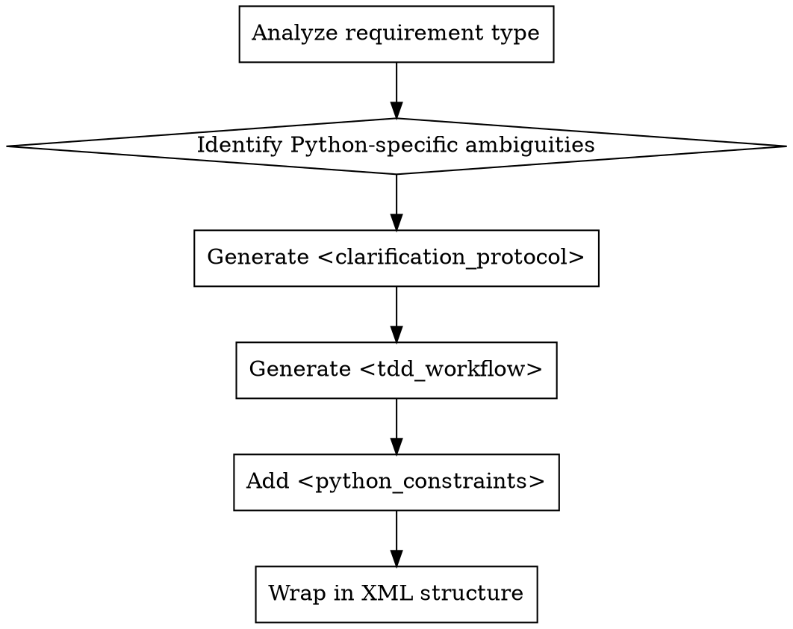

# Generate Py Prompt

## Overview

**Core principle:** Transform vague Python development requirements into structured, TDD-driven prompts that force Agent to clarify before coding.

This skill generates a complete XML-structured prompt that enforces:
1. **Agentic boundaries** - precise file location, minimal changes
2. **TDD discipline** - RED (failing test) → GREEN (minimal code) → REFACTOR
3. **Human-in-the-loop clarification** - A/B options for Python-specific ambiguities
4. **Python best practices** - pytest, type hints, PEP 8, async awareness

## When to Use

Use this skill when:
- User provides a vague Python requirement like "add authentication" or "fix the API"
- Starting any Python feature/bugfix where requirements need clarification
- You need to delegate Python implementation to another Agent with clear constraints
- The Python environment, concurrency model, or dependencies are unclear

Do NOT use this skill when:
- Requirements are already crystal clear with all technical decisions made
- Working on non-Python projects
- The user explicitly says "no questions, just implement"

## Prompt Generation Workflow



## Requirement Type Analysis

Before generating the prompt, classify the requirement:

| Type | Indicators | Focus Areas |
|------|------------|-------------|
| **Bug fix** | "fix", "broken", "error", "crash" | Root cause, reproduction, regression tests |
| **New feature** | "add", "create", "implement" | Boundaries, interfaces, acceptance criteria |
| **Refactor** | "clean up", "improve", "restructure" | Behavior preservation, test coverage |
| **Performance** | "slow", "optimize", "speed up" | Benchmarks, profiling, measurable targets |

## Python-Specific Ambiguities (Always Clarify)

Generate A/B options for these uncertainties:

### 1. Environment & Tooling
- Virtual environment: `venv` vs `poetry` vs `uv`
- Python version: 3.8+ vs 3.10+ vs 3.12+
- Linter: `ruff` vs `flake8` vs `pylint`

### 2. Concurrency Model
- Synchronous (blocking I/O, simpler)
- Asynchronous (asyncio, httpx, non-blocking)
- Mixed (executor for CPU-bound, async for I/O)

### 3. Data Handling
- Plain dicts vs dataclasses vs Pydantic models
- JSON vs messagepack vs protobuf
- In-memory vs SQLite vs PostgreSQL

### 4. Testing Approach
- Unit tests with mocks vs integration tests
- `unittest.mock` vs `pytest-mock`
- Real I/O in tests (when justified) vs strict mocking

### 5. Dependencies
- Standard library only vs third-party allowed
- Specific library requirements (e.g., `httpx` not `requests`)
- Pinning strategy (exact versions vs ranges)

## XML Prompt Template

Generate prompts using this exact structure:

```xml
<objective>
[One sentence: what the Agent should implement]
</objective>

<context>
[2-3 sentences: why this matters, where it fits in the project]
</context>

<clarification_protocol>
Before implementing, answer these questions by presenting A/B options to the user:

1. **Environment**: [Option A vs Option B with trade-offs]
2. **Concurrency**: [Synchronous vs Asynchronous with use-case reasoning]
3. **Dependencies**: [Library A vs Library B or standard library only]
4. **Data structures**: [Dict vs dataclass vs Pydantic]
5. **Testing**: [Mock-heavy unit tests vs integration-style tests]

WAIT for user response before proceeding to TDD workflow.
</clarification_protocol>

<tdd_workflow>
**Phase 1 - RED (Failing Test):**
1. Create test file: tests/test_<feature>.py
2. Write pytest test that fails because feature doesn't exist
3. Run: pytest tests/test_<feature>.py -v (expect: FAILED)
4. Show user the RED result

**Phase 2 - GREEN (Minimal Code):**
1. Write minimum code in <feature>.py to pass test
2. Include type hints on ALL functions
3. Include docstrings on ALL public functions/classes
4. Run: pytest tests/test_<feature>.py -v (expect: PASSED)
5. Show user the GREEN result

**Phase 3 - REFACTOR:**
1. Improve code structure (extract functions, reduce duplication)
2. Add edge case tests, then handle edge cases
3. Run linters: ruff check --fix . && ruff format .
4. Run type checker: mypy . (must pass with zero errors)
5. Show user the final result
</tdd_workflow>

<python_constraints>
**Mandatory requirements:**
- Type hints: All functions must have complete type annotations (PEP 484)
- Docstrings: Google-style or NumPy-style on all public functions/classes
- PEP 8: Use ruff for linting and formatting
- Testing: Use pytest (NOT unittest.TestCase)
- Mocking: Use unittest.mock or pytest-mock for I/O boundaries
- Environment: Confirm virtual environment before pip install or pytest

**Python-specific traps to avoid:**
- NEVER use mutable default arguments (list, dict) without None guard
- NEVER mix blocking I/O (requests, time.sleep) in async functions
- NEVER make real I/O calls in unit tests (always mock)
- NEVER import circularly (restructure if circular import error)
- NEVER skip type hints with "it's obvious"

**Agentic boundaries:**
- Read files before writing: understand existing patterns first
- Minimal changes: modify only files directly affected
- No scaffolding: don't create unused files or boilerplate
</python_constraints>

<verification>
**Before claiming completion, verify:**
1. All tests pass: pytest -v (zero failures)
2. Type checking passes: mypy . (zero errors)
3. Linting passes: ruff check . (zero warnings)
4. Coverage (optional): pytest --cov=<feature> --cov-report=term-missing
5. No circular imports
6. No blocking calls in async code (if applicable)
</verification>
```

## Example Generated Prompt

Here's how the skill transforms a vague requirement into a structured prompt:

**Input requirement:** "Add user login to the API"

**Generated prompt:**

```xml
<objective>
Implement user authentication (login) for the Flask API with JWT token generation.
</objective>

<context>
This feature enables secure user sessions for the existing user management system.
It will integrate with the current User model and database schema.
</context>

<clarification_protocol>
Before implementing, answer these questions:

1. **Environment**:
   - A) Use existing venv with Flask 2.x
   - B) Create new poetry environment with Flask 3.x

2. **Concurrency**:
   - A) Synchronous Flask (blocking I/O, simpler)
   - B) Async Flask with Quart (non-blocking, more complex)

3. **JWT Library**:
   - A) PyJWT (lightweight, standard)
   - B) Flask-JWT-Extended (Flask-specific, more features)

4. **Password hashing**:
   - A) bcrypt (slow, secure)
   - B) argon2 (memory-hard, more secure)

5. **Testing**:
   - A) Mock database calls (pure unit tests)
   - B) Real SQLite tests (integration-style)

WAIT for user response before proceeding.
</clarification_protocol>

<tdd_workflow>
[Same as template above, customized for login feature]
</tdd_workflow>

<python_constraints>
[Same as template, with additions:]

**Security-specific constraints:**
- NEVER store plaintext passwords
- NEVER log sensitive data (tokens, passwords)
- ALWAYS use constant-time comparison for tokens
- ALWAYS validate token expiration

**Dependency constraints:**
- Pin exact versions in requirements.txt
- No breaking changes from existing dependencies
</python_constraints>

<verification>
[Same as template, with additions:]
- Security check: No hardcoded secrets
- Security check: Token expiration working
</verification>
```

## Implementation

To generate a prompt from a requirement:

```python
def generate_prompt(requirement: str) -> str:
    """Generate structured prompt from vague requirement.

    Args:
        requirement: User's vague requirement (e.g., "add login")

    Returns:
        Complete XML-structured prompt with all sections
    """
    # 1. Analyze requirement type
    req_type = classify_requirement(requirement)

    # 2. Identify ambiguities
    ambiguities = identify_python_ambiguities(requirement)

    # 3. Generate clarification protocol
    clarification = generate_clarification_protocol(ambiguities)

    # 4. Generate full XML prompt
    return build_xml_prompt(requirement, req_type, clarification)
```

## Quick Reference

| Section | Purpose | Key Content |
|---------|---------|-------------|
| `<objective>` | One-sentence goal | What to build |
| `<context>` | Background | Why it matters |
| `<clarification_protocol>` | HITL questions | A/B options for Python decisions |
| `<tdd_workflow>` | RED-GREEN-REFACTOR | Test-first implementation steps |
| `<python_constraints>` | Python best practices | Type hints, PEP 8, async rules |
| `<verification>` | Completion checklist | Tests, linting, type checking |

## Common Mistakes

### Mistake 1: Skipping Clarification
**Bad:** Jumping straight to implementation
**Fix:** Force Agent to present A/B options first

### Mistake 2: Vague Constraints
**Bad:** "Use good Python style"
**Fix:** "Use ruff check, mypy, type hints on ALL functions"

### Mistake 3: No Agentic Boundaries
**Bad:** "Implement the feature"
**Fix:** "Read files first, modify only affected files, no scaffolding"

### Mistake 4: Missing Verification
**Bad:** "Test it works"
**Fix:** "pytest -v, mypy ., ruff check . - all must pass with zero errors"

## Rationalization Table

| Excuse | Reality |
|--------|---------|
| "This is simple, no need for questions" | Simple requirements hide async/dependency traps. Always clarify. |
| "TDD is too slow for this" | Untested code slows every future change. TDD is faster long-term. |
| "I'll ask questions as I code" | Questions mid-implementation = wasted work. Clarify FIRST. |
| "Real I/O tests = more confidence" | Flaky, slow, require setup. Mocks are deterministic. |
| "Type hints are optional" | Type hints prevent 40% of bugs. Mandatory for production code. |

## Red Flags

**STOP if the Agent tries to:**
- Implement before answering clarification questions
- Write tests after implementation code
- Use global Python environment without venv check
- Make real I/O calls in unit tests
- Skip type hints with "it's obvious"

**All of these mean:** Re-run this skill to regenerate a stricter prompt.

## Output

The output of this skill is a complete XML-structured prompt ready to be:
1. Pasted to another Agent for implementation
2. Saved as a task specification
3. Used as a sub-agent prompt

Do NOT implement the Python code directly - this skill generates the INSTRUCTION, not the implementation.
